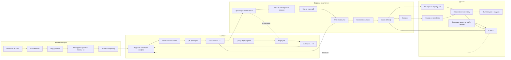
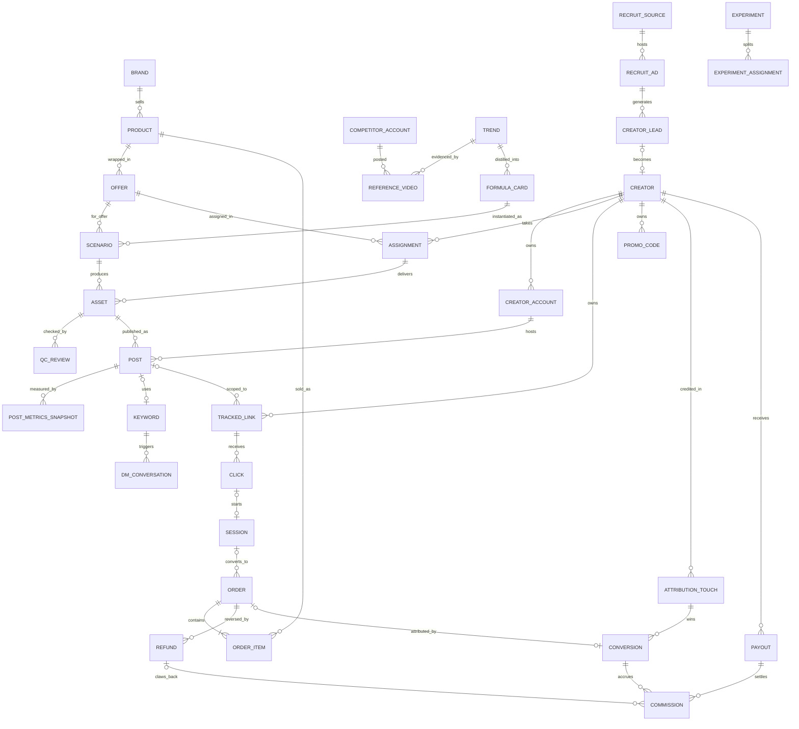

# ViralForge × Likky — система и сквозная аналитика (v1)

**Дата:** 2026-10-08 · Asia/Dubai (UTC+4)
**Статус:** spec v1 · для основателя и ботов-исполнителей
**Опирается на:** `CONCEPT.md` · `PRD.md` · `MVP_LOCK.md` · `DATA_MODEL.md` · `ATTRIBUTION.md` · `TREND_ENGINE.md` · `CREATIVE_ENGINE.md` · `QC_CHECKLIST.md` · `formula-card.schema.json` · `scenario.schema.json` · `../likky-apify-partner-pack.md`
**DDL:** `analytics_schema.sql` (Postgres, те же сущности и поля)
**Конвенции (как в DATA_MODEL):** имена сущностей/полей English · enum `UPPER_SNAKE` · деньги = integer cents + `currency` · время = `timestamptz`, отчёты в Asia/Dubai · PII только хэшами.

> **Правило честности:** в этом документе нет цифр нашего бизнеса. Всё неизвестное = `[X]`. Цифры из Apify — это скрейп конкурентов, не наши продажи.

---

## 0. Что изменилось относительно прежних спек (и почему)

| # | Было | Стало | Почему |
|---|------|-------|--------|
| 1 | `MVP_LOCK`: только sandbox, без реальных денег | Две «дорожки» в одной модели: **ViralForge app = sandbox** (без изменений) и **Likky Partner Program = реальные продажи и выплаты** (живые креаторы из Telegram) | Основатель запустил найм живых креаторов под реальный магазин. Различаем флагом `is_sandbox` на Order / Accrual / Payout. Lock для приложения не трогаем |
| 2 | `OFFER.cpa_fixed_cents` + `revshare_pct` (от net) | `Offer.payout_rule` = `CPA_FIXED` \| `PCT_REVENUE` \| `PCT_MARGIN` \| `HYBRID` + `payout_value` | Основатель озвучил «до 15% от маржи»; держим все варианты, решение = открытый вопрос §10 |
| 3 | `LedgerEntry` | `Commission` (начисление) + `Payout`; ledger = view над ними | Нужен отдельный статус удержания (`HELD → APPROVED → PAID / CLAWED_BACK`) для аналитики «к выплате» |
| 4 | Атрибуция: только creator×offer | + **уровень поста**: `TrackedLink` и `Keyword` можно привязать к `Post` | Без этого нельзя посчитать «какая формула/тренд продаёт». Evergreen-ссылка creator×offer остаётся как в ATTRIBUTION §2.2 |
| 5 | — | Добавлены найм (`RecruitSource`, `RecruitAd`, `CreatorLead`), расходы (`CostItem`), эксперименты (`Experiment`) | Сквозная экономика: сколько стоит активный креатор и продажа целиком |

Маппинг имён на DATA_MODEL: `User` → **Creator** · `SocialSlot` → **CreatorAccount** · `OfferClaim` → **Assignment** · `CreativeBatch`+`Clip` → **Asset** (batch_id остаётся полем) · `AttributionEvent` → **AttributionTouch** · `LedgerEntry` → **Commission** + **Payout**. Остальное совпадает.

---

## 1. Карта системы



Одна цепочка ID проходит через всё: `trend_id → formula_id → scenario_id → assignment_id → asset_id → post_id → link_token / keyword / promo_code → order_id → commission_id → payout_id`. Это и есть «сквозная».

---

## 2. Сущности

Источник: **APIFY** · **SOCIAL** (IG/TT/YT: scrape или API) · **SHOPIFY** (likky.store) · **REDIR** (наш редиректор ссылок) · **PIXEL** (Shopify Custom Pixel) · **DM** (бот/ManyChat или ручной ввод) · **APP** (ViralForge / админка) · **HIGGS** (Higgsfield) · **MANUAL** (оператор, Sheet).

### 2.1 Магазин и офферы

| Сущность | Зачем | Ключевые поля | Кто создаёт | Источник |
|---|---|---|---|---|
| **Brand** (Store) | Владелец каталога; сейчас один — Likky | `id, name, domain, platform=SHOPIFY, shop_id, currency, timezone` | оператор, 1 раз | MANUAL |
| **Product** (SKU/variant) | Что продаём и сколько зарабатываем | `id, brand_id, shopify_product_id, shopify_variant_id, sku, title, handle, pdp_url, price_cents, cogs_cents, shipping_cost_cents, payment_fee_pct, margin_cents (вычисл.), status` | синк каталога; COGS вводит основатель | SHOPIFY + MANUAL (COGS) |
| **Offer** | Product + правило выплаты + правила креатива | `id, product_id, name, payout_rule, payout_value, hold_days, attribution_window_days, geos[], claim_strip[], allowed_claims[], creative_limit, buyer_discount_pct, is_sandbox, status` | основатель | APP/MANUAL |

`margin_cents = price − cogs − shipping_cost − round(price × payment_fee_pct)`; на уровне заказа считаем фактическую маржу (§6.4).

### 2.2 Тренды и креатив

| Сущность | Зачем | Ключевые поля | Кто создаёт | Источник |
|---|---|---|---|---|
| **CompetitorAccount** | Чьи ролики разбираем | `id, platform, handle, niche_bucket, followers, first_seen_at` | Trend Engine | APIFY |
| **ReferenceVideo** | Конкретный вирусный ролик-доказательство | `id, competitor_account_id, platform, url, code_or_id, plays, likes, comments, shares, saves (null≠0), duration_s, music_id, cta_pattern, scrape_date, apify_run_id, apify_dataset_id` | Trend Engine | APIFY |
| **Trend** | Кластер похожих вирусных роликов/паттерн/звук | `id, name, niche_bucket, platform, signal (pattern / sound / hashtag / seasonal), viral_score, first_seen_at, status` | Trend Scout | APIFY + разметка |
| **FormulaCard** | Повторяемая формула: хук→демо→эмоция→CTA | поля `formula-card.schema.json` + `trend_id, version, status` | Trend Scout | APP |
| **Scenario** (Brief/ТЗ) | Исполнимое ТЗ на 1 ролик | поля `scenario.schema.json` (`scenario_id, pattern, sku, prompt, on_screen_text, duration_sec, keyword, caption_skeleton, account_slot, qc_flags…`) + `formula_id, offer_id, mode (AI / HUMAN)` | Creative Engine / оператор | APP |
| **Asset** (Clip) | Готовый mp4 | `id, scenario_id, assignment_id, creator_id, batch_id, source (AI_HIGGSFIELD / HUMAN / HYBRID), file_url, duration_sec, aspect, higgsfield_job_id, cost_credits, status` | Higgsfield или креатор | HIGGS / APP |
| **QCReview** | Анти-slop гейт до поста | `id, asset_id, reviewer (BOT / HUMAN), verdict (PASS / FIX / KILL), score, flags[], reviewed_at` | QC-бот / оператор | APP |
| **Keyword** (CTA) | Кодовое слово «пиши X в комменты» | `id, keyword (UPPER), creator_id, offer_id, post_id?, status (ACTIVE / RETIRED / ABUSED)` | авто-минт | APP |

### 2.3 Креаторы и найм

| Сущность | Зачем | Ключевые поля | Кто создаёт | Источник |
|---|---|---|---|---|
| **RecruitSource** | Где ищем (TG-чат, канал, биржа) | `id, type (TG_CHAT / TG_CHANNEL / REFERRAL / APP_SIGNUP / OTHER), name, url, audience_size` | оператор | MANUAL |
| **RecruitAd** | Конкретная публикация объявления | `id, source_id, variant (A/B текст), text_hash, posted_at, cost_cents, start_code` (уник. стартовое слово/дип-линк `t.me/<bot>?start=ad_xxx`) | оператор | MANUAL |
| **CreatorLead** | Человек, написавший в ЛС | `id, recruit_ad_id, tg_username_hash, stage, samples_urls[], rejection_reason, created_at, stage_changed_at` | DM-бот / оператор | DM / MANUAL |
| **Creator** | Партнёр (живой, наш AI-аккаунт или юзер app) | `id, lead_id?, type (PARTNER_HUMAN / INTERNAL_AI / APP_USER), display_name, geo, tier, quality_score, payout_method, payout_currency, kyc_status, status, activated_at` | онбординг | APP / MANUAL |
| **CreatorAccount** | Соц-аккаунт креатора | `id, creator_id, platform (IG / TT / YT), handle, url, followers, slot_role (HERO / GIFT / SEASONAL), verified_at` | креатор при онбординге | APP + SOCIAL (верификация) |
| **Assignment** | Креатор × оффер (= OfferClaim) | `id, creator_id, offer_id, scenario_ids[], posts_target, due_at, status (ACTIVE / EXHAUSTED / EXPIRED / REVOKED)` | оператор / app | APP |

Стадии лида: `NEW → REPLIED → SAMPLES_SENT → APPROVED → ONBOARDED → FIRST_POST → FIRST_SALE` + терминальные `REJECTED / GHOSTED`. Creator создаётся на `ONBOARDED`. **Активный** = ≥ [3] постов за последние 7 дней (порог подбираем).

### 2.4 Посты и воронка

| Сущность | Зачем | Ключевые поля | Кто создаёт | Источник |
|---|---|---|---|---|
| **Post** | Опубликованный ролик | `id, asset_id, creator_account_id, assignment_id, platform, permalink, platform_post_id, posted_at, caption, has_disclosure, keyword_id, status (LIVE / DELETED / BANNED)` | креатор (`post_confirm`) | APP + SOCIAL |
| **PostMetricsSnapshot** | Метрики поста во времени | `id, post_id, captured_at, age_hours, views, likes, comments, shares, saves, avg_watch_s?, hold_3s_pct?, keyword_comments?, source (APIFY / API / SCREENSHOT)` | скрейпер по расписанию | APIFY / SOCIAL / MANUAL |
| **DMConversation** | Ответ на кодовое слово | `id, post_id?, keyword_id, creator_id, platform, fan_handle_hash, started_at, link_sent_at, link_token, source (MANYCHAT / BOT / SELF_REPORT)` | DM-бот или креатор | DM / MANUAL |
| **TrackedLink** | Персональная ссылка | `token (PK), creator_id, offer_id, post_id?, sub_id?, promo_code_id?, dest_url, utm_* , created_at, revoked_at` | app (автоминт) | REDIR |
| **PromoCode** | Внутренний ID креатора `LIKKY-{NICK}` (в Shopify не заводится; запасной сигнал) | `code, creator_id, offer_id, shopify_discount_id, discount_pct, status` | оператор / app | SHOPIFY |
| **Click** | Переход по ссылке | `id, token, clicked_at, ip_hash, ua_hash, referer, country, is_bot, visitor_id` | редиректор | REDIR |
| **Session** (Visitor) | Визит в магазин | `id, visitor_id, token?, started_at, landing_url, utm_*, pages, product_viewed, added_to_cart, checkout_started` | Custom Pixel | PIXEL |

### 2.5 Заказы, атрибуция, деньги

| Сущность | Зачем | Ключевые поля | Кто создаёт | Источник |
|---|---|---|---|---|
| **Order** | Заказ Shopify | `id, external_id (UK), brand_id, ordered_at, currency, subtotal_cents, discount_cents, shipping_cents, tax_cents, total_cents, financial_status, customer_hash, is_first_order, landing_site, referring_site, discount_codes[], note_attributes, is_sandbox` | webhook `orders/paid` | SHOPIFY |
| **OrderItem** | Строка заказа | `id, order_id, product_id, variant_id, qty, price_cents, cogs_cents (снапшот), discount_cents` | webhook | SHOPIFY |
| **Refund** | Возврат / отмена / чарджбэк | `id, order_id, external_id, type (REFUND / CANCEL / CHARGEBACK), amount_cents, created_at, reason` | webhook `refunds/create`, `orders/cancelled` | SHOPIFY |
| **AttributionTouch** | Любое касание, указывающее на креатора | `id, type (LINK_CLICK / PROMO / KEYWORD / DM / PIXEL / MANUAL), creator_id, offer_id, post_id?, token?, visitor_id?, occurred_at, raw` | редиректор, пиксель, DM, оператор | REDIR / PIXEL / DM / MANUAL |
| **Conversion** | Решение: этот заказ — этого креатора/поста | `id, order_id (UK), touch_id, creator_id, post_id?, offer_id, method, model (LAST_PAYABLE), window_days, first_touch_id?, is_valid, fraud_flag` | движок атрибуции | APP |
| **Commission** (Accrual) | Начисление креатору | `id, conversion_id, creator_id, kind (CPA / REVSHARE / BONUS / ADJUSTMENT / CLAWBACK), basis_cents, rate, amount_cents (подписанная), currency, status (HELD / APPROVED / PAID / VOID), hold_until, payout_id?, idempotency_key (UK)` | движок | APP |
| **Payout** | Выплата пачкой | `id, creator_id, period_start, period_end, amount_cents, currency, fx_rate, method (CARD_RU / USDT / WISE / PAYPAL / OTHER), status (DRAFT / PROCESSING / PAID / FAILED), paid_at, proof_ref, is_sandbox` | оператор по пятницам | MANUAL → APP |
| **CostItem** | Любой расход | `id, category (HIGGSFIELD / APIFY / ADS / SAMPLES / RECRUIT_AD / TOOLS / FEES / OTHER), amount_cents, currency, incurred_at, ref_type, ref_id (asset / post / creator / recruit_ad / offer), external_ref, note` | синк/оператор | HIGGS / APIFY / MANUAL |
| **Experiment** | A/B: хук, CTA, текст объявления, ставка | `id, name, hypothesis, entity_type (FORMULA / SCENARIO / RECRUIT_AD / OFFER), variants jsonb, primary_metric, started_at, ended_at, result` + **ExperimentAssignment** `(experiment_id, variant, entity_id)` | основатель / Trend Scout | APP |

---

## 3. Связи



Неочевидное:
- **Trend ↔ FormulaCard ↔ Scenario** — 1:N:N. Одна формула даёт десятки ТЗ (разные SKU, слоты, хуки). Продажи суммируем вверх по цепочке `Conversion.post → Asset → Scenario → Formula → Trend`.
- **Asset → Post 1:N.** Один ролик может уйти на 3 аккаунта (IG/TT/YT) или к нескольким креаторам (REUSE). Метрики и продажи считаем **по посту**, качество креатива — по asset/scenario.
- **TrackedLink: evergreen + пост.** У креатора есть ссылка creator×offer (био) и, опционально, ссылки creator×offer×post (в DM-скрипте поста). Ссылка без поста = продажа идёт креатору/офферу, но в «формулу» попадает как `unknown_post`.
- **Order ↔ Conversion 1:0..1.** Максимум одна оплачиваемая конверсия на заказ (dedupe). Все остальные касания остаются в `AttributionTouch` для аналитики first-touch.
- **Commission 1:N на Conversion.** Начисление + возможный CLAWBACK (отрицательная строка) + BONUS. Баланс = сумма строк; ничего не удаляем.
- **CreatorLead → Creator 0..1.** Позволяет считать CAC креатора по источнику найма и LTV креатора по исходному чату.
- **CostItem** полиморфный (`ref_type, ref_id`), чтобы привязать кредиты Higgsfield к asset, сэмпл — к креатору, объявление — к RecruitAd.

---

## 4. События (event taxonomy)

Формат: `object_action`, snake_case. Обязательные свойства у всех: `event_id (uuid, idempotent)`, `occurred_at`, `source`, `is_sandbox`. Хранение: таблица `events` (append-only) + материализация в сущности.

**Платформа магазина (проверено 2026-10-08 по HTTP-заголовкам и HTML likky.store):** **Shopify** (`powered-by: Shopify`, shop_id `107855249749`, `yp7wcs-nv.myshopify.com`, валюта витрины USD, тема `halloween-theme-l`). Web pixels: Shopify native, 1 custom pixel, приложения Trustoo (отзывы) и ParcelWill (трекинг посылок). **GA4 / Meta / TikTok pixel в HTML не обнаружены.** Shareable discount links `likky.store/discount/{CODE}` работают (302). → используем вебхуки Shopify + Custom Pixel (Customer Events) + discount links.

| Событие | Когда | Обязательные свойства | Источник |
|---|---|---|---|
| `trend_scraped` | завершился Apify run | `apify_run_id, dataset_id, actor, query, platform, rows, cost_usd` | APIFY (webhook run succeeded) |
| `reference_video_upserted` | строка датасета нормализована | `platform, code_or_id, plays, shares, comments, saves|null` | APIFY |
| `formula_created` | новая/обновлённая карточка | `formula_id, trend_id, version, niche_bucket` | APP |
| `scenario_created` | ТЗ готово | `scenario_id, formula_id, offer_id, mode` | APP |
| `recruit_ad_posted` | объявление опубликовано | `recruit_ad_id, source_id, variant, cost_cents` | MANUAL |
| `lead_created` | человек написал в ЛС | `lead_id, recruit_ad_id|null, start_code|null` | DM-бот / MANUAL |
| `lead_stage_changed` | смена стадии | `lead_id, from, to, reason?` | MANUAL / DM-бот |
| `creator_onboarded` | лид стал креатором | `creator_id, lead_id, accounts[]` | APP |
| `assignment_created` | выдан оффер+ТЗ | `assignment_id, creator_id, offer_id, scenario_ids[]` | APP |
| `asset_generated` | mp4 готов | `asset_id, scenario_id, source, higgsfield_job_id?, credits?` | HIGGS / APP |
| `asset_submitted` | креатор прислал ролик на проверку | `asset_id, creator_id, assignment_id` | APP / MANUAL |
| `qc_reviewed` | вердикт QC | `asset_id, verdict, score, flags[]` | APP |
| `post_published` (`post_confirm`) | креатор прислал permalink | `post_id, asset_id, creator_account_id, platform, permalink, keyword` | APP / MANUAL |
| `post_metrics_captured` | снапшот T+1h/24h/72h/7d/30d | `post_id, age_hours, views, likes, comments, shares, saves?, source` | APIFY (`instagram-post-details`, `tiktok-scraper`); YT — YouTube Data API `videos.list` (в pack актора нет) |
| `keyword_comment_detected` | коммент с кодовым словом | `post_id, keyword, comment_id_hash` | DM-бот/ManyChat; или Apify comments actor `[TBD]` |
| `dm_link_sent` | ссылка отправлена в DM | `dm_id, keyword, link_token, post_id?` | DM-бот / SELF_REPORT |
| `link_clicked` | хит редиректора | `token, ip_hash, ua_hash, referer, country, is_bot, visitor_id` | REDIR |
| `page_viewed` / `product_viewed` / `product_added_to_cart` / `checkout_started` / `checkout_completed` | события витрины | `visitor_id, vf_token|null, url, product_id?, value_cents?` | PIXEL (Shopify Custom Pixel → наш `/collect`) |
| `order_paid` | оплачен | `external_id, total_cents, items[], discount_codes[], landing_site, note_attributes, customer_hash` | SHOPIFY webhook `orders/paid` |
| `order_refunded` / `order_cancelled` / `chargeback_opened` | возврат | `external_id, refund_id, amount_cents, type` | SHOPIFY `refunds/create`, `orders/cancelled`, disputes |
| `conversion_attributed` | движок решил | `order_id, creator_id, post_id?, method, touch_id, window_days` | APP |
| `commission_accrued` / `commission_approved` / `commission_clawed_back` | движение начислений | `commission_id, kind, amount_cents, hold_until` | APP |
| `payout_paid` | выплата отправлена | `payout_id, creator_id, amount_cents, currency, method, proof_ref` | MANUAL |
| `cost_recorded` | любой расход | `category, amount_cents, ref_type, ref_id` | HIGGS (`transactions`) / APIFY usage / MANUAL |
| `experiment_assigned` | вариант назначен | `experiment_id, variant, entity_type, entity_id` | APP |

---

## 5. Атрибуция

> **Решение основателя (2026-10-08): коды скидок Shopify не используем — атрибуция только по ссылкам.** Ссылка ведёт прямо на товар `likky.store/products/{handle}?ref={slug}&utm_source={platform}&utm_medium=creator&utm_campaign={creator}&utm_content={post}`; `ref` = slug трекинг-ссылки (= код поста). `LIKKY-{NICK}` остаётся только внутренним ID креатора.

Совместимо с `ATTRIBUTION.md`: **последнее оплачиваемое не-фрод касание в окне** выигрывает; приоритет при равенстве `LINK (ref) > PIXEL > KEYWORD > MANUAL`, код скидки — лишь запасной сигнал, если вдруг есть в заказе; платим только за оплаченный заказ, пережив удержание.

### 5.1 Идентификаторы в цепочке

| Носитель | Формат | Что связывает | Как доходит до заказа |
|---|---|---|---|
| **Tracked link** | slug `{nick}-{N}`; короткая `https://go.likky.store/{slug}` (считает клики; GitHub Pages `kisa134/likky-go` → `…/functions/v1/r?s={slug}`) | creator × offer × post | 302 → `likky.store/products/{handle}?ref={slug}&utm_source={platform}&utm_medium=creator&utm_campaign={creator}&utm_content={slug}` → в Shopify попадает в `landing_site` / `landing_site_ref`; сниппет темы дублирует `ref` в атрибуты корзины (`_vf_ref`) → `note_attributes` |
| **Creator ID** | `LIKKY-{NICK}` | creator | внутренний идентификатор; в Shopify не заводится. Если заказ вдруг несёт такой код скидки — используется как запасной сигнал |
| **Keyword** | `DRAGON`, `GLOW42` (формульное слово + суффикс креатора/поста) | creator × offer (± post) | сам по себе не оплачивается; в DM уходит ссылка поста → LINK |
| **Pixel token** | `vf_token` в cookie/localStorage 7d [окно `[X]`] | visitor → token | Custom Pixel шлёт `checkout_completed` с `vf_token` → матч по `order_id` |
| **Manual** | оператор | любой заказ | очередь «неатрибутированные заказы» |

Ключевой риск link-only: `landing_site` — первая страница **визита с заказом**. Если покупатель вернулся позже напрямую или с другого устройства (Instagram in-app браузер → Safari), метки нет. Защита: (1) сниппет темы хранит `ref` 7 дней в localStorage и пишет в атрибуты корзины; (2) кнопка ручной привязки в кабинете (`attribute_order_manual`); (3) доля «без креатора» — метрика здоровья атрибуции.

### 5.2 Алгоритм матча (на `order_paid`)

```
1. Dedupe: Order.external_id уже есть → stop (idempotent).
2. Собрать кандидатов-касаний за окно [attribution_window_days, default 7 — open в MVP_LOCK]:
   a. LINK: ref/utm_content из landing_site, landing_site_ref, note_attributes (_vf_ref), referring_site → TrackedLink;
      иначе utm_campaign → Creator
   b. PIXEL: checkout_completed с vf_token, совпавший order_id (v2)
   c. KEYWORD / MANUAL: кодовое слово или ник в атрибутах заказа; ручная привязка в кабинете
   d. (запасной) discount_codes ∩ внутренние ID LIKKY-{NICK}, если вдруг есть
3. Отбросить: revoked токены, is_bot клики, fraud (self-order: customer_hash = хэш креатора; IP-шторм).
4. Победитель = первый найденный по приоритету LINK > PIXEL > KEYWORD > MANUAL > (код скидки).
   Нет сигналов → заказ «без креатора», событие order_unattributed → ручная привязка.
5. Записать Conversion (order_id UK) + сохранить first_touch_id (самое раннее касание) для аналитики.
6. post_id = из токена поста; если токен evergreen — из последнего DM/keyword этого фаната, если есть; иначе null.
7. Commission: HELD, hold_until = ordered_at + hold_days [default 14, как clawback_days в DATA_MODEL].
8. Ежедневно: HELD и hold_until < now и нет возврата → APPROVED. Пятница: APPROVED → в Payout.
```

### 5.3 Модели и правила

- **Оплата креатору = last-click (last payable touch).** Просто и проверяемо для креаторов.
- **Аналитика = обе модели:** last-click (деньги) и first-touch (какой пост/формула «привела» покупателя). Мульти-тач (например 10/90) — позже, ATTRIBUTION §9.
- **Repeat-заказ** того же `customer_hash` в окне — по `Offer.payout_rule` (`HYBRID`: CPA за первый, % за повторные) — как DATA_MODEL §3.
- **Возврат до выплаты:** Commission → `VOID`. **После выплаты:** строка `CLAWBACK` с минусом, вычитается из следующей выплаты; отрицательный баланс блокирует выплаты.
- **Частичный возврат:** clawback пропорционально `refund / total`.
- **Неатрибутированные заказы** тоже храним — это «органика»; доля органики = метрика здоровья атрибуции.

---

## 6. Метрики (формулы)

Окно по умолчанию: 7 дней; время — Asia/Dubai. `views` = последний снапшот поста ≤ 7d (или «на день 7»).

### 6.1 Тренды и формулы
| Метрика | Формула |
|---|---|
| Formula hit rate | `posts формулы с views_7d ≥ [порог X] / posts формулы` |
| Median views per formula | `median(views_7d) по постам формулы` |
| Sales per formula | `Σ conversions (post→asset→scenario→formula)` |
| Revenue per 1k views (формула) | `revenue_attr / Σ views × 1000` |
| Trend → formula yield | `formulas с ≥1 продажей / formulas из тренда` |
| Time-to-post | `median(posted_at − scenario.created_at)` |

### 6.2 Контент
| Метрика | Формула |
|---|---|
| Views / post | `views_7d` |
| 3s hold | `hold_3s_pct` (только из инсайтов аккаунта: скрин/API; иначе null) |
| ER | `(likes + comments + shares + saves) / views` |
| Share rate | `shares / views` |
| Keyword comment rate | `keyword_comments / views × 1000` |
| QC pass rate | `asset PASS / asset reviewed` (цель PRD ≥ 80%) |

### 6.3 Воронка
| Шаг | Формула |
|---|---|
| keyword → DM | `dm_link_sent / keyword_comments` |
| DM → click | `clicks (uniq visitor) по токенам из DM / dm_link_sent` |
| Post CTR | `uniq clicks / views` |
| click → order (CR) | `orders_attr / uniq clicks` |
| AOV | `Σ total_cents attr / orders_attr` |
| Refund rate | `refunded orders / orders_attr` |
| Organic share | `orders без Conversion / all orders` |

### 6.4 Деньги
| Метрика | Формула |
|---|---|
| Net revenue | `Σ (subtotal − discount) − refunds` (без tax и shipping, если доставку не продаём) |
| Contribution margin (заказ) | `net revenue − Σ cogs − shipping_cost − payment_fees` |
| Commission cost | `Σ Commission (APPROVED+PAID − CLAWBACK)` |
| Content cost | `Σ CostItem HIGGSFIELD + APIFY + SAMPLES (+ADS)` |
| **CAC per sale** | `(commission + content cost + recruit cost) / orders_attr` |
| **Profit after creators** | `margin − commission − content cost − recruit cost` |
| ROMI | `profit after creators / (commission + content cost + recruit cost)` |
| EPC (креатору) | `commission / uniq clicks` |
| Earnings per 1k views | `commission / views × 1000` (для креатора) · `margin / views × 1000` (для нас) |
| Creator LTV | `Σ margin заказов креатора − Σ его commission` (за всё время / 90д) |
| Cost per AI clip | `credits_cost / assets AI` |

### 6.5 Креаторы
| Метрика | Формула |
|---|---|
| Activation rate | `creators с FIRST_POST за ≤ 7д от онбординга / onboarded` |
| Sale activation | `creators с FIRST_SALE ≤ 14д / onboarded` |
| Posts per creator per day | `posts / active creators / days` |
| % earning | `creators с ≥1 commission за 7д / active creators` |
| Churn | `active прошлой недели без постов 7д / active прошлой недели` |
| Quality score | как DATA_MODEL §3.2 (refund ↓, viral ↑) |

### 6.6 Найм
| Метрика | Формула |
|---|---|
| Ad → lead | `leads / recruit_ads` (и на 1000 участников чата) |
| Lead → approved / onboarded / active | доли по стадиям, по `source_id` и `variant` |
| Cost per active creator | `Σ cost RECRUIT_AD + SAMPLES / active creators` по источнику |
| Revenue by source | `Σ margin заказов креаторов из источника` |
| Time to first sale | `median(first_sale_at − lead.created_at)` |

**Топ-5 для основателя:** Profit after creators/день · CAC per sale · Revenue per 1k views (по формуле) · click→order CR · % earning creators.

---

## 7. Дашборды

1. **Founder daily** (одна страница)
   - KPI: заказы attr / органика · net revenue · contribution margin · commission · content cost · **profit after creators** · CAC per sale (сегодня / 7д / Δ к прошлой неделе)
   - Воронка 7д: views → keyword → DM → clicks → sessions → orders → refunds (числа + % перехода)
   - Топ-5 постов по продажам · топ-5 креаторов · активные креаторы / посты сегодня
   - Алерты: refund rate > [X]%, креатор с clicks без продаж > [X], расход кредитов > лимита, вебхук молчит > 24ч
2. **Content / Formula**
   - Таблица формул: posts, hit rate, median views, ER, keyword rate, sales, revenue per 1k views, cost per clip
   - Scatter: views vs sales (каждая точка = пост, цвет = формула)
   - Кривые роста views по возрасту поста (1h/24h/72h/7d) по формулам
   - AI vs HUMAN: те же метрики, сравнение по `asset.source`
   - Список «залетевших» постов для virality loop (remake)
3. **Creator leaderboard**
   - Таблица: креатор, источник найма, tier, posts 7д, views, clicks, orders, CR, EPC, earnings 7д / all-time, refund rate, quality score, last post
   - Фильтры: источник, оффер, платформа; сортировка по earnings/CR
   - Когорты по неделе онбординга: % с первым постом/продажей
4. **Finance / Payouts**
   - P&L недели: revenue, refunds, COGS, shipping, fees, commission, Higgsfield, Apify, сэмплы, найм, profit
   - Начисления по статусам: HELD / APPROVED (к выплате в пятницу) / PAID / CLAWBACK
   - Реестр выплат: креатор, сумма, валюта, курс, метод, статус, пруф
   - Неатрибутированные заказы (очередь ручного матча) · фрод-холды
5. **Recruiting**
   - Воронка по источнику (чат) и варианту объявления: ads → leads → samples → approved → onboarded → first post → first sale → active
   - Cost per active creator, revenue by source, time to first sale
   - Таблица лидов в работе с возрастом стадии (кто завис > 48ч)

---

## 8. Архитектура данных

### 8.1 Day-1 (неделя 1, почти без кода)

| Источник | Чем собираем | Куда | Частота |
|---|---|---|---|
| Каталог + COGS | Shopify export + ручной COGS | Sheet `products`, `offers` | при изменении |
| Ссылки и клики | **редиректор** (Supabase edge function `r`): `/r?s={slug}` → лог клика → 302 на страницу товара с `ref` | Sheet `clicks` (через Apps Script webhook) или Supabase | real-time |
| Заказы и возвраты | Shopify Admin → Notifications → **Webhooks** `orders/paid`, `refunds/create`, `orders/cancelled` → тот же endpoint (HMAC) · fallback: ежедневный CSV-экспорт заказов | Sheet `orders`, `order_items`, `refunds` | real-time / daily |
| Сессии | Shopify **Custom Pixel** (Settings → Customer events) → `/collect` | Sheet `sessions` (или пропустить day-1) | real-time |
| Посты | креатор кидает permalink в форму/чат (`post_confirm`) | Sheet `posts` | при посте |
| Метрики постов | Apify `instagram-post-details` + `clockworks/tiktok-scraper` по списку permalink; YT Data API | Sheet `post_metrics` | 1×/день (T+24h, 72h, 7d) |
| DM / keyword | self-report креатора в форме (кол-во комментов/DM за день) | Sheet `dm_daily` | daily |
| Найм | оператор ведёт таблицу лидов; уник. стартовое слово на объявление | Sheet `recruit_ads`, `leads` | real-time руками |
| Расходы | Higgsfield `transactions`, Apify usage, сэмплы руками | Sheet `costs` | weekly |
| Выплаты | Sheet `commissions`, `payouts` (формулы) | — | weekly (пятница) |

**Реализовано (v1.2, 2026-10-08):** кабинет `/analytics` + инструкция `/guide` в репо `viralforge-sandbox` → https://kisa134.github.io/viralforge-sandbox/analytics/ . Переключатель источника **Демо / Мои CSV / База**. **Атрибуция только по ссылкам** (решение основателя: без кодов скидок): генератор даёт ссылку прямо на товар `likky.store/products/{handle}?ref={slug}&utm_*` (в «Базе» + короткая `https://go.likky.store/{slug}`, считает клики). «Мои CSV» — рабочее место в браузере: креаторы, ссылки с QR/DM, импорт CSV заказов Shopify (в экспорте нет источника → колонка `creator`/`ref` или ручной выбор креатора по заказу), правило выплаты фикс $/% заказа/% маржи с COGS, удержание 14 дн, «Отметить выплачено», бэкап JSON. «База» — Supabase `wdvwinmsdkortvchkgxe`: миграции `supabase/migrations` (RLS только для email из `admins`), edge-функции `r` (клик → `click` + `events` → 302 на товар) и `shopify-orders-webhook` (HMAC; `ref` из `landing_site`/`landing_site_ref`/`note_attributes`/`referring_site` → ссылка → креатор → conversion → commission HELD; возврат → VOID/CLAWBACK), функция `attribute_order_manual` для ручной привязки, вход по magic link. Шаги запуска — `docs/GO_LIVE.md` (включая сниппет темы, сохраняющий `ref` в атрибуты корзины).

### 8.2 v2 (после ≥ [X] активных креаторов или ≥ [X] заказов/нед)

- **Postgres (Supabase)** = схема `analytics_schema.sql`. Совпадает с `MVP_LOCK` (Node + Postgres + BullMQ).
- **Ingestion:** edge functions `/c/{token}`, `/collect` (pixel), `/webhooks/shopify/*` (HMAC), `/webhooks/apify` (run succeeded) → `events` (append-only) → воркер материализует сущности и запускает атрибуцию.
- **Джобы (BullMQ/cron):** снапшоты постов (T+1h, 24h, 72h, 7d, 30d) · ежедневный approve удержаний · пятничная сборка выплат · синк каталога · синк расходов Higgsfield/Apify.
- **DM:** ManyChat / IG Messaging API на аккаунтах креаторов (если согласны) → `keyword_comment_detected`, `dm_link_sent` автоматически.
- **BI:** Metabase (или кабинет `/analytics` на Supabase) поверх views `v_funnel_daily`, `v_formula_perf`, `v_creator_leaderboard`, `v_pnl_weekly`, `v_recruit_funnel`.
- **PII:** email/phone/IP/TG — только sha256 с солью; сырые payload ≤ 90 дней (ATTRIBUTION §6).

---

## 9. MVP за 1 неделю (по порядку)

1. **День 1.** Заполнить `products` (цена из Shopify, COGS `[X]` от основателя) и `offers` (правило выплаты `[X]`). Коды скидок в Shopify не заводим (link-only); ID креаторов `LIKKY-{NICK}` — внутренние, для первых креаторов.
2. **День 1.** Google Sheet с вкладками = таблицы §8.1 (имена колонок = поля DDL, чтобы потом залить в Postgres без маппинга).
3. **День 2.** Редиректор `/c/{token}` (Vercel/Cloudflare) → лог клика → 302 на `likky.store/products/{handle}?ref={slug}&utm_*`. Генератор ссылок: creator × offer × post.
4. **День 2.** Shopify webhooks `orders/paid`, `refunds/create`, `orders/cancelled` → endpoint → Sheet. Тестовый заказ по ссылке креатора (по `P1_TEST_ORDER_CHECKLIST.md`): код и `landing_site` дошли.
5. **День 3.** Найм: на каждое объявление — уникальное стартовое слово («пиши ХОЧУ-[чат]») → вкладка `leads` со стадиями; скрипт ЛС из чата уже есть.
6. **День 3.** Форма `post_confirm` для креаторов (permalink + keyword) → `posts`.
7. **День 4.** Ежедневный Apify-снапшот метрик по списку permalink (бюджет `[X]` $/день — только после ОК основателя) + YT Data API.
8. **День 4.** Атрибуция в Sheet/скрипте: LINK (ref) → MANUAL; `conversions`, `commissions` (HELD, hold 14д).
9. **День 5.** Кабинет `/analytics`: CSV-импорт заказов и постов → 5 вкладок (Воронка, Ролики/Формулы, Креаторы, Финансы, Найм).
10. **День 6.** Custom Pixel → `/collect` (сессии, ATC, checkout) — если успеваем; иначе неделя 2.
11. **День 7.** Первая пятничная выплата по реестру + ретро: где рвётся цепочка ID, что автоматизировать в v2 (Supabase).

---

## 10. Открытые вопросы к основателю (меняют дизайн)

1. **Правило выплаты:** фикс за продажу (`$[X]`) / % от чека / % от маржи (`до 15%`)? Если от маржи — нужны COGS + доставка по каждому SKU, и креаторам придётся показывать расчёт.
2. ~~Скидка по коду креатора~~ — **решено 2026-10-08: без кодов, только ссылки.** Открыто: кто поставит сниппет `ref` → атрибуты корзины в тему Shopify (нужен доступ Online Store → Themes → Edit code)? Без него теряются заказы «вернулся позже напрямую».
3. **Гео покупателей vs аудитория креаторов:** магазин в USD (merchant country в настройках Shopify = IT), а креаторов ищем в RU-чатах. Куда магазин доставляет и какую аудиторию должны иметь аккаунты креаторов (US/EU/RU)? Влияет на офферы, валюту и фильтр трафика.
4. **Рельсы и валюта выплат:** карта РФ (₽) / USDT / Wise / PayPal; минимальная сумма; фиксируем курс на дату выплаты?
5. **Окно атрибуции и удержание:** 7 или 30 дней (открыто в MVP_LOCK); hold 14 дней от заказа или от доставки?
6. **DM:** креаторы отвечают на кодовые слова руками или ставим ManyChat/бота на их аккаунты? От этого зависит, меряем ли keyword→DM автоматически или по self-report.

---
*Grok Bot · ViralForge × Likky · 2026-10-08 Asia/Dubai*
